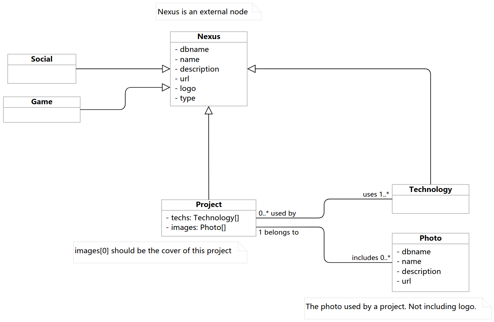

# wcnexus

Site wcnexus.com is Chenxuan (Steve)'s personal website.

The original purpose of developing this website was to practice my skills in software development, it was also one of my wish of having my own website a couple of years ago.

## Deployment

(Docker or CI instruction is still in the planning phase.)

## Development

This branch represents the latest v4 development. See the master branch for current online version (v3).

[Server](https://github.com/valorad/wcnexus-server)

Still planning on it. Will probably use MongoDB + .Net (C#) + Normal REST APIs.

[Client](https://github.com/valorad/wcnexus-client)

Client is currently work in progress. Featuring Angular 11 (TypeScript) + Reveal.js 4.

## Class Diagram

